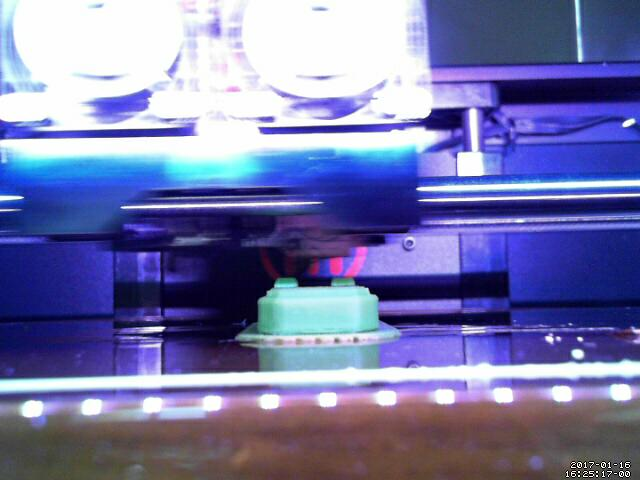

makerbot-notify
===============

For Makerware email notifications (on Linux)

-	Send an email when Makerware print job completes on Replicator 2/2X.

	-	Can send (optional) webcam capture with the email, e.g. from `motion`

-	Only tested on Ubuntu 16.04 (Makerware's most recent supported release)

	-	Makerware has been abandoned by Makerbot, but is still the recommended slicer for Replicator 2X



Background
==========

I was jealous when OctoPrint jobs had all sorts of fancy plugins with webcam support, etc.

One big annoyance with using MakerWare was not having email notifications when a job was complete. I made this python script to fix that!

Limitations at the moment
=========================

-	Assumes gmail + Linux for email.
	-	filesystem stuff probably would need some updates on other platforms (have not tried)
-	Designed for USB tethered Makerware prints
    - Works by locating and parsing the Makerware's app logfile

Usage
=====

```bash
cd ~/projects/makerbot-notify
cp ./create_cfg.py ./create_cfg_custom.py
chmod +x ./create_cfg_custom.py

# edit create_cfg_custom.py to match your gmail setting
# - motion_dir should match motion.conf `target_dir`
# - creates an output file 'example.json'
./create_cfg_custom.py

cd ~
# <<assumes makerware is already open/running!>>
~/projects/makerbot-notify/read_log.py
```

Relies on a JSON config file. Copy `create_cfg.py` to `create_cfg_custom.py` to match your config. Run it to create `example.json` JSON config file. Then launch the script (after Makerware has been opened).

Includes webcam support based on `motion` app, which can include an image from the completed print in the email.

### example output

from the terminal

```
PrintDialog job: set job ID 1
Job 1 concluded
print job pgp-4-top.gcode concluded took 0:20:09
will send notice
sending email
From: your@gmail.com
To: your@gmail.com
Subject: pgp-4-top.gcode concluded

print job pgp-4-top.gcode concluded took 0:20:09

Email sent!
```

installing this script
----------------------

1.	Clone the repo locally
2.	Copy/customize `create_cfg.py` and then run it
3.	Run `read_log.py` which reads in config just created

Platform notes
==============

Ubuntu 16.04
------------

If you get error like this

```
ImportError: No module named dateutil.parser
```

```
sudo apt install python-dateutil
```
